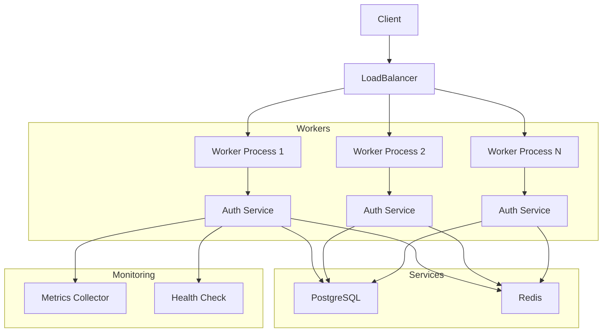
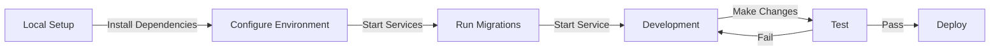
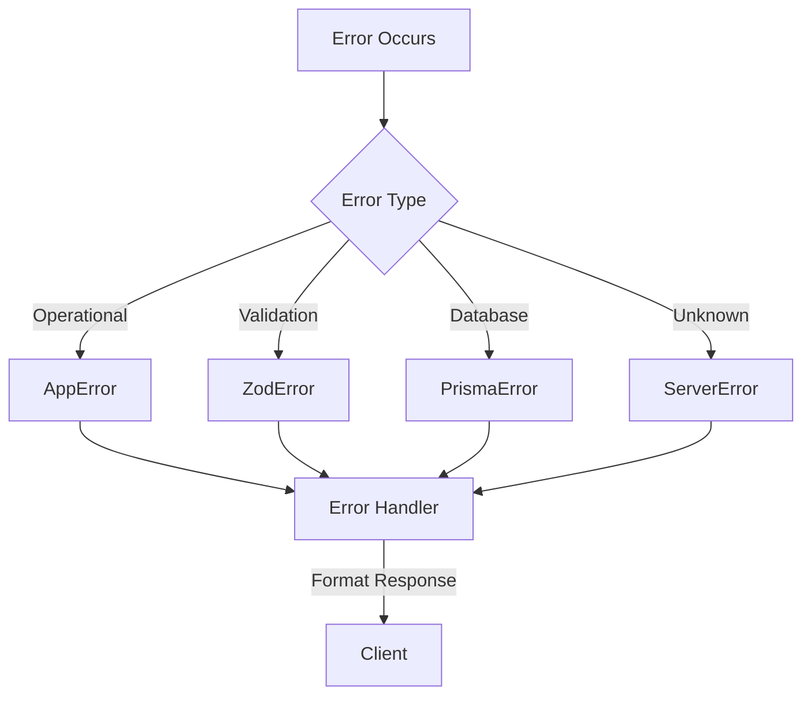

# Auth Service

A scalable authentication service built with Node.js, TypeScript, and Express, featuring multi-version API support, JWT authentication, and comprehensive monitoring.

## Table of Contents
- [Features](#features)
- [Architecture](#architecture)
- [Prerequisites](#prerequisites)
- [Installation](#installation)
- [Usage](#usage)
- [API Documentation](#api-documentation)
- [Monitoring](#monitoring)

## Features

- 🔐 JWT-based authentication
- 📦 Multi-version API support (v1, v2)
- 🚀 Scalable architecture with clustering
- 📊 Built-in monitoring and health checks
- 🔄 Automatic worker recovery
- 📝 Swagger API documentation
- 🎯 Rate limiting and security features
- 🗄️ PostgreSQL for persistent storage
- 💾 Redis for caching and sessions

## Architecture



## Prerequisites

- Node.js 18+
- PostgreSQL 14+
- Redis 6+
- macOS or Linux

## Installation

### 1. Install Dependencies

```bash
# Clone the repository
git clone <repository-url>
cd services/auth-service

# Install service dependencies
./scripts/install-dependencies.sh
```

### 2. Start Local Services

```bash
# Start PostgreSQL and Redis
./scripts/start-local-services.sh
```

### 3. Environment Setup

```bash
# Copy example environment file
cp .env.example .env

# Update environment variables as needed
nano .env
```

### 4. Database Setup

```bash
# Run database migrations
npx prisma migrate dev
```

## Usage

### Starting the Service

```bash
# Development mode
npm run dev

# Production mode
npm run build
npm start
```

### API Endpoints

#### V1 Endpoints

\`\`\`
POST /api/v1/auth/register
POST /api/v1/auth/login
POST /api/v1/auth/refresh
POST /api/v1/auth/logout
\`\`\`

#### V2 Endpoints (includes all V1 endpoints plus)

\`\`\`
POST /api/v2/auth/logout-all
\`\`\`

### Example Usage

```typescript
// Register a new user
const response = await fetch('http://localhost:3000/api/v2/auth/register', {
  method: 'POST',
  headers: {
    'Content-Type': 'application/json'
  },
  body: JSON.stringify({
    email: 'user@example.com',
    password: 'securePassword123',
    firstName: 'John',
    lastName: 'Doe'
  })
});

const { user, tokens } = await response.json();
```

## API Documentation

Access the Swagger UI documentation at:
\`\`\`
http://localhost:3000/api-docs
\`\`\`

## Monitoring

### Health Checks

```bash
# Check service health
curl http://localhost:3000/health
```

### Metrics

```bash
# View service metrics
curl http://localhost:3000/metrics
```

### Service Management

```bash
# View service status
brew services list

# Restart services
brew services restart postgresql@14
brew services restart redis
```

## Development Flow



## Error Handling

The service implements a comprehensive error handling system:



## Security Features

- JWT-based authentication
- Rate limiting
- CORS protection
- Request validation
- Session management
- Password hashing
- Secure headers

## Contributing

1. Fork the repository
2. Create your feature branch
3. Commit your changes
4. Push to the branch
5. Create a new Pull Request

## License

MIT 